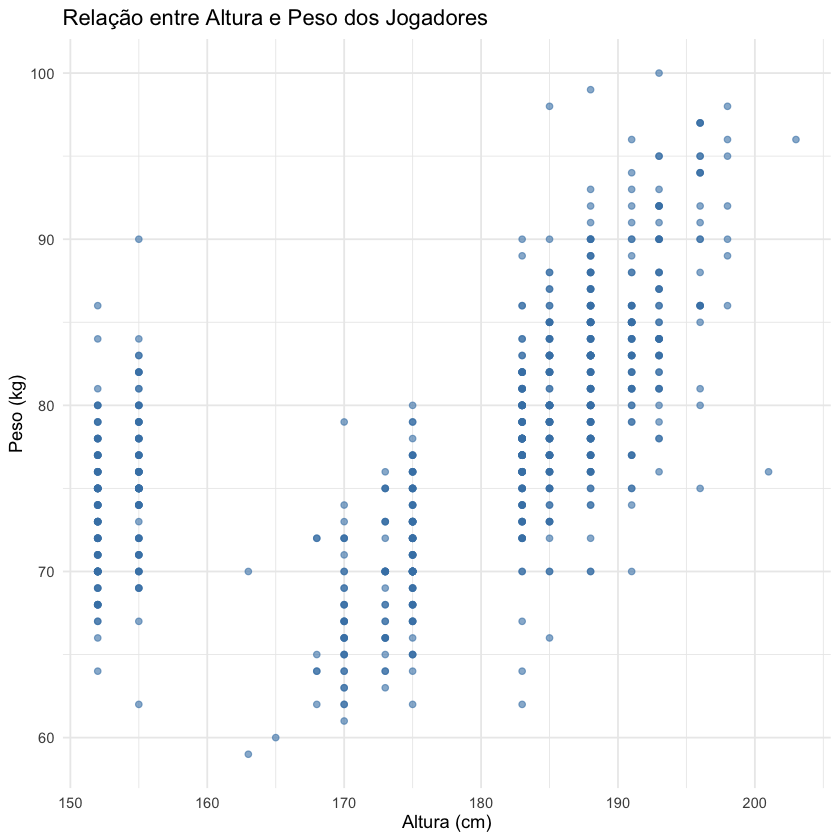
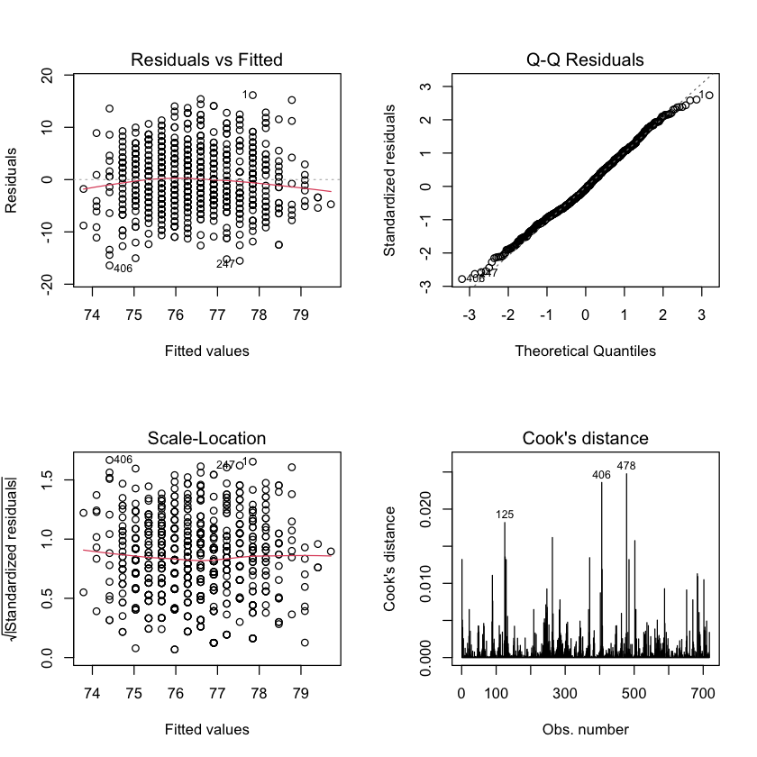

# FIFA National Teams — Applied Statistics in R

Statistical study of 718 players from FIFA world national teams, written in **R**: descriptive statistics and probability models in part one, inference and regression in part two.

## Overview

The dataset describes players called up to national teams (age, height, weight, club, nationality, position, overall rating, skill ratings). The work goes from describing the sample to drawing conclusions about the population:

1. **`notebooks/01_descriptive_statistics.ipynb`** — variable typing (nominal, ordinal, discrete, continuous), frequency tables, position and dispersion measures, `ggplot2` charts, and a check of how well a theoretical probability model fits the empirical distribution (empirical vs. theoretical CDF).
2. **`notebooks/02_inference_and_regression.ipynb`** — conditional and unconditional probabilities, confidence intervals, one-sample t-tests, simple linear regression and full residual diagnostics.

## Tech stack

`R` · `tidyverse` · `ggplot2` · `readxl` · `skimr` · `MASS` · `knitr` · Jupyter (IRkernel)

## Results

- **Sample:** 718 players, 717 degrees of freedom in every one-sample test.
- **Confidence intervals (95%):** mean height between **175.97 cm and 178.07 cm** (point estimate 177.02 cm); mean weight between **77.13 kg and 78.20 kg**.
- **Hypothesis tests:** H₀ *mean height = 178 cm* rejected (t = 185.34, p < 2.2e-16); H₀ *mean international reputation = 2* rejected (t = −9.84, p < 2.2e-16, CI 1.61–1.74).
- **Regression `overall_rating ~ age`:** each additional year is worth **+0.31 rating points** (β = 0.312, p = 5.09e-07), but **R² = 0.035** — age alone explains only 3.5% of the variation, so it is a statistically significant yet practically weak predictor.
- **Diagnostics:** residuals vs. fitted shows no trend, Scale-Location is flat (constant variance), Q-Q aligns except in the tails, Shapiro-Wilk W = 0.995 (p = 0.017), and Cook's distance flags observations 125, 406 and 478 as influential without any exceeding the usual cut-off.
- **Probabilities:** P(forward) = 72/718 ≈ 0.10 unconditionally; conditional probabilities were computed for movement skill given the defender position.

## Visuals

| Height vs. weight | Regression diagnostics |
|---|---|
|  |  |

## How to run

Requires R (≥ 4.0) with the [IRkernel](https://irkernel.github.io/) registered in Jupyter:

```r
install.packages(c("readxl", "skimr", "ggplot2", "tidyverse", "knitr", "MASS", "IRkernel"))
IRkernel::installspec()
```

Then:

```bash
jupyter lab notebooks/01_descriptive_statistics.ipynb
```

## Data

The player dataset is read straight from a public URL inside the notebooks, so they are reproducible without any manual download; a local copy is also committed at `data/raw/fifa_national_teams.csv` (semicolon-separated, latin-1). `data/raw/data_dictionary.xlsx` describes every column.

## Project structure

```
├── data/raw
│   ├── fifa_national_teams.csv   # 718 players
│   └── data_dictionary.xlsx      # column descriptions
├── notebooks
│   ├── 01_descriptive_statistics.ipynb
│   └── 02_inference_and_regression.ipynb
└── reports/figures
```

> Analysis and comments inside the notebooks are written in Brazilian Portuguese.
